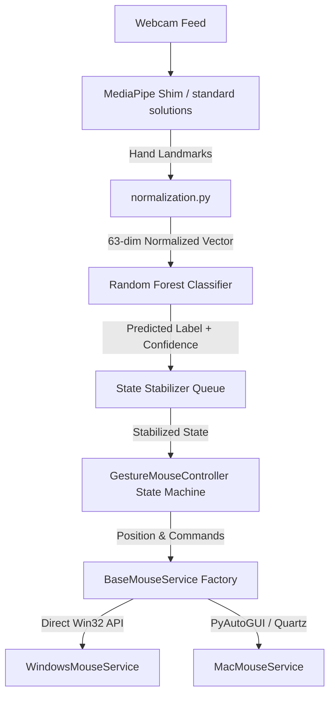

# 🚀 Hybrid ML Hand Gesture Mouse Control System

An advanced, real-time hybrid machine learning hand gesture mouse controller that maps physical hand movements and postures to smooth cursor movement and OS-level operations. 

By leveraging **Google MediaPipe** for precise hand landmark tracking, **Scikit-Learn** for real-time postural classification, and **Platform-Specific OS APIs**, this system offers a zero-latency, cross-platform fluid gesture control experience.

---

## ✨ Features

*   **🏆 High-Fidelity Hybrid ML Pipeline**: Couples hand landmark tracking with a custom Random Forest Classifier to distinguish five distinct postures.
*   **📊 Stable Real-Time Estimation**: Integrates three layers of state stabilization:
    *   **EMA Smoothing**: Exponential Moving Average filtering for jitter-free cursor tracking.
    *   **Majority Voting**: Sliding-window queue voting over a set number of frames (`--history`).
    *   **Confidence Thresholding**: Filters weak or unstable ML predictions below a target threshold (`--confidence`).
*   **🖥️ Custom Glassmorphic HUD overlay**: Features an OpenCV heads-up display rendering active zone boundaries, system state, prediction confidence, real-time FPS, screen target positions, and a votes queue visualization.
*   **⚡ Zero-Latency OS Integration**:
    *   **macOS / Generic**: Leverages PyAutoGUI with optimized zero-pause parameters.
    *   **Windows**: Employs direct Win32 `ctypes` assembly calls for zero-dependency hardware mouse events.
*   **📐 Invariant Normalization**: A geometric pre-processing algorithm that guarantees **translation invariance** (wrist centered at origin) and **scale invariance** (scaled by distance between wrist and middle MCP).
*   **🔄 Python 3.13+ Compatibility**: Includes a custom MediaPipe tasks API shim wrapper (`mediapipe_shim.py`) to bypass legacy solutions framework limitations.
*   **🛡️ Fail-Safe Emergency Stop**: Quick fail-safe activated by moving your hand/cursor to any screen corner.

---

## 🛠️ Project Architecture



### Component Breakdown

*   `collect_data.py`: Interactive recording tool to construct personalized CSV landmark datasets.
*   `train.py`: Classifier model trainer with synthetic data generators.
*   `gesture_mouse.py`: Core execution loop containing the main controller state machine and HUD renderer.
*   `normalization.py`: Landmark centering and scaling utilities.
*   `mediapipe_shim.py`: Modern Google MediaPipe Tasks HandLandmarker shim wrapper & glowing neon skeleton visual renderer.
*   `logger.py`: ANSI-colored system-wide logger.
*   `test_camera.py`: Extensive unit testing suite with simulated hand pipelines.
*   `services/`: Operating system interface abstractions containing direct OS mouse controls.

---

## 🖐️ Gesture Command Schema

| Gesture / State | Gesture Pose | Mapped Action |
| :--- | :--- | :--- |
| **`idle` (0)** | Relaxed, open hand or closed fist | Safe posture; no tracking, no actions |
| **`move` (1)** | Index finger extended, others curled | Smoothly tracks cursor positioning |
| **`click` (2)** | Thumb and index tip pinched together | Debounced primary left click |
| **`drag` (3)** | Thumb, index, and middle tips pinched | Activates primary mouse down to drag |
| **`scroll` (4)** | Index and middle extended upward | Vertically scrolls screen matching finger shifts |

---

## ⚙️ Installation

### 1. Clone the Repository
```bash
git clone https://github.com/your-username/hybrid-gesture-mouse.git
cd hybrid-gesture-mouse
```

### 2. Setup Virtual Environment
```bash
python -m venv venv
source venv/bin/activate  # On Windows: venv\Scripts\activate
```

### 3. Install Dependencies
```bash
pip install -r requirements.txt
```

---

## 🚀 Step-by-Step Workflow

### 🚀 Step 1: Record Custom Hand Posture Data
To capture training data matching your unique hand structure:
```bash
python collect_data.py
```
*   **Controls**:
    *   Press numbers `[0]` through `[4]` to change the target gesture label.
    *   Press `[Spacebar]` to **Start / Pause** recording landmarks into the session buffer.
    *   Press `[C]` to clear recorded samples for the active gesture.
    *   Press `[Q]` to save accumulated samples to `gestures_dataset.csv` and exit safely.

---

### 🏋️ Step 2: Train the ML Model
Train the Random Forest Classifier on your newly collected dataset:
```bash
python train.py
```

> [!TIP]
> **No Webcam? No Problem!**
> Run `python train.py --synthetic` to generate a high-quality synthetic dataset to immediately verify compilation, training, and tracking loops.

---

### 🕹️ Step 3: Launch real-time Gesture Control
Start the system engine:
```bash
python gesture_mouse.py
```

#### Customizable Options:
Configure sensitivity, smoothing, and debounce thresholds directly from the CLI:
```bash
python gesture_mouse.py --smoothing 0.3 --confidence 0.8 --history 5 --debounce 0.35
```

```text
Arguments:
  --model MODEL         Path to trained model pickle (default: gesture_model.pkl)
  --smoothing SMOOTHING EMA smoothing factor (0 = static, 1 = raw jittery) (default: 0.25)
  --confidence CONF     Minimum probability to accept predicted state changes (default: 0.75)
  --history HISTORY     Queue size for majority voting filter (default: 7)
  --debounce DEBOUNCE   Cooldown in seconds to trigger subsequent clicks (default: 0.4)
  --scroll-sens SENS    Scroll vertical sensitivity multiplier (default: 1.5)
```

---

## 🧪 Running Unit Tests

The test suite validates tracking logic, recording, and controller loop structures using mocks:
```bash
python -m unittest test_camera.py
```

---

## 🛡️ License

Distributed under the MIT License. See `LICENSE` for more information.
