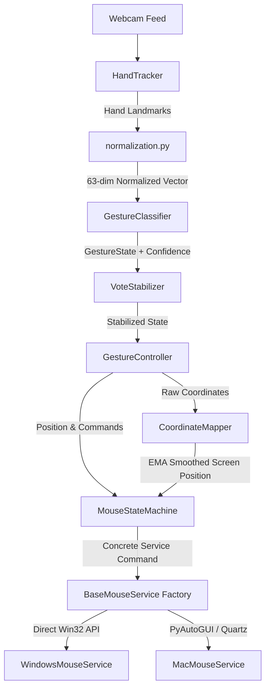

# 🚀 Layered Hybrid ML Hand Gesture Mouse Control System

An advanced, real-time hybrid machine learning hand gesture mouse controller that maps physical hand movements and postures to smooth cursor movement and OS-level operations.

By leveraging **Google MediaPipe** for precise hand landmark tracking, **Scikit-Learn** for real-time postural classification, and **Platform-Specific OS APIs**, this system offers a zero-latency, cross-platform fluid gesture control experience.

The system features a **layered, SOLID-compliant architecture** with strict separation of responsibilities between tracking, classification, UI drawing, state machine logic, and OS services.

---

## ✨ Features

*   **🏆 High-Fidelity Hybrid ML Pipeline**: Couples hand landmark tracking with a custom Random Forest Classifier to distinguish six distinct postures.
*   **📊 Stable Real-Time Estimation**: Integrates three layers of state stabilization:
    *   **EMA Smoothing**: Exponential Moving Average filtering for jitter-free cursor tracking.
    *   **Majority Voting**: Sliding-window queue voting over a set number of frames (`--history`).
    *   **Confidence Thresholding**: Filters weak or unstable ML predictions below a target threshold (`--confidence`).
*   **🖥️ Custom Glassmorphic HUD overlay**: Features an OpenCV heads-up display rendering active zone boundaries, system state, prediction confidence, real-time FPS, screen target positions, and a votes queue visualization.
*   **⚡ Zero-Latency OS Integration**:
    *   **macOS / Generic**: Leverages PyAutoGUI with optimized zero-pause parameters.
    *   **Windows**: Employs direct Win32 `ctypes` assembly calls for zero-dependency hardware mouse events.
*   **📐 Invariant Normalization**: A geometric pre-processing algorithm that guarantees **translation invariance** (wrist centered at origin) and **scale invariance** (scaled by distance between wrist and middle MCP).
*   **🔄 Python 3.13+ Compatibility**: Includes a custom MediaPipe tasks API shim wrapper (`utils/mediapipe_shim.py`) to bypass legacy solutions framework limitations.
*   **🛡️ Fail-Safe Emergency Stop**: Quick fail-safe activated by moving your hand/cursor to any screen corner.

---

## 🛠️ Project Architecture



### Component Breakdown

*   `main.py`: Root application entry point. Parses options, loads models, resolves OS services, and starts the loop.
*   `config/settings.py`: Centralized global configurations, class mappings, palettes, and thresholds.
*   `controller/gesture_controller.py`: Engine orchestrator connecting tracker, classifier, stabilizers, and renderer together.
*   `tracking/`:
    *   `hand_tracker.py`: Pure MediaPipe/shim hand detection.
    *   `normalization.py`: Landmark centering and scaling utilities.
    *   `coordinate_mapper.py`: Active-zone mapping and EMA smoothing.
*   `classification/`:
    *   `gesture_classifier.py`: ML prediction wrapper.
    *   `vote_stabilizer.py`: Sliding-window majority voting state.
    *   `model_loader.py`: Deserializes pickle model from disk.
*   `state_machine/`:
    *   `gesture_state.py`: IntEnum replacing magic integers.
    *   `mouse_state_machine.py`: Gesture execution, transitions, failsafe triggers, and service coordination.
*   `ui/hud_renderer.py`: Pure OpenCV visual HUD and skeletal overlay drawing code.
*   `utils/`: Colors format logging, FPS performance counters, and MediaPipe shim shunts.
*   `services/`: Operating system interface abstractions containing direct OS mouse controls.
*   `training/`: Scripts and datasets for model collection and training.

---

## 🖐️ Gesture Command Schema

| Gesture / State | Gesture Pose | Mapped Action |
| :--- | :--- | :--- |
| **`idle` (0)** | Relaxed, open hand or closed fist | Safe posture; no tracking, no actions |
| **`move` (1)** | Index finger extended, others curled | Smoothly tracks cursor positioning |
| **`click` (2)** | Thumb and index tip pinched together | Debounced primary left click |
| **`drag` (3)** | Thumb, index, and middle tips pinched | Activates primary mouse down to drag |
| **`scroll_up` (4)** | Index, middle, and ring extended upward | Scrolls screen upward at a configured rate |
| **`scroll_down` (5)** | Index, middle, ring, and pinky extended upward | Scrolls screen downward at a configured rate |

---

## ⚙️ Installation

### 1. Clone the Repository
```bash
git clone https://github.com/your-username/hybrid-gesture-mouse.git
cd hybrid-gesture-mouse
```

### 2. Setup Virtual Environment
```bash
python -m venv venv
source venv/bin/activate  # On Windows: venv\Scripts\activate
```

### 3. Install Dependencies
```bash
pip install -r requirements.txt
```

---

## 🚀 Step-by-Step Workflow

### 🚀 Step 1: Record Custom Hand Posture Data
To capture training data matching your unique hand structure:
```bash
python training/collect_data.py
```
*   **Controls**:
    *   Press numbers `[0]` through `[5]` to change the target gesture label.
    *   Press `[Spacebar]` to **Start / Pause** recording landmarks into the session buffer.
    *   Press `[C]` to clear recorded samples for the active gesture.
    *   Press `[Q]` to save accumulated samples to `training/gestures_dataset.csv` and exit safely.

---

### 🏋️ Step 2: Train the ML Model
Train the Random Forest Classifier on your newly collected dataset:
```bash
python training/train.py
```

> [!TIP]
> **No Webcam? No Problem!**
> Run `python training/train.py --synthetic` to generate a high-quality synthetic dataset to immediately verify compilation, training, and tracking loops.

---

### 🕹️ Step 3: Launch Real-Time Gesture Control
Start the refactored layered control engine:
```bash
python main.py
```

#### Customizable Options:
Configure sensitivity, smoothing, and debounce thresholds directly from the CLI:
```bash
python main.py --smoothing 0.3 --confidence 0.8 --history 5 --debounce 0.35
```

```text
Arguments:
  --model MODEL         Path to trained model pickle (default: models/gesture_model.pkl)
  --smoothing SMOOTHING EMA smoothing factor (0 = static, 1 = raw jittery) (default: 0.25)
  --confidence CONF     Minimum probability to accept predicted state changes (default: 0.75)
  --history HISTORY     Queue size for majority voting filter (default: 7)
  --debounce DEBOUNCE   Cooldown in seconds to trigger subsequent clicks (default: 0.4)
  --scroll-sens SENS    Scroll vertical sensitivity multiplier (default: 1.5)
  --scroll-step STEP    Discrete scroll step size (default: 2)
```

---

## 🧪 Running Unit Tests

The test suite validates tracking logic, recording, and controller loop structures using mocks:
```bash
python -m unittest tests/test_camera.py
```

---

## 🛡️ License

Distributed under the MIT License. See `LICENSE` for more information.
